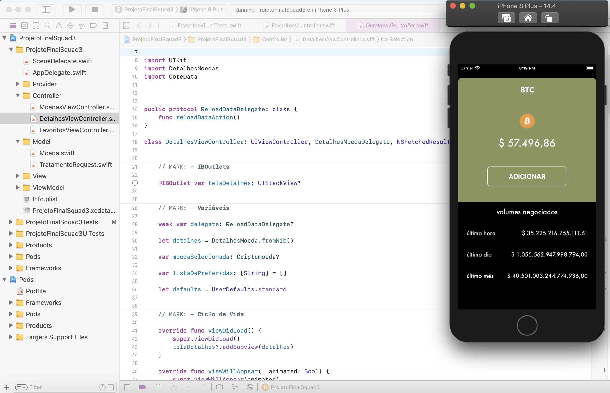
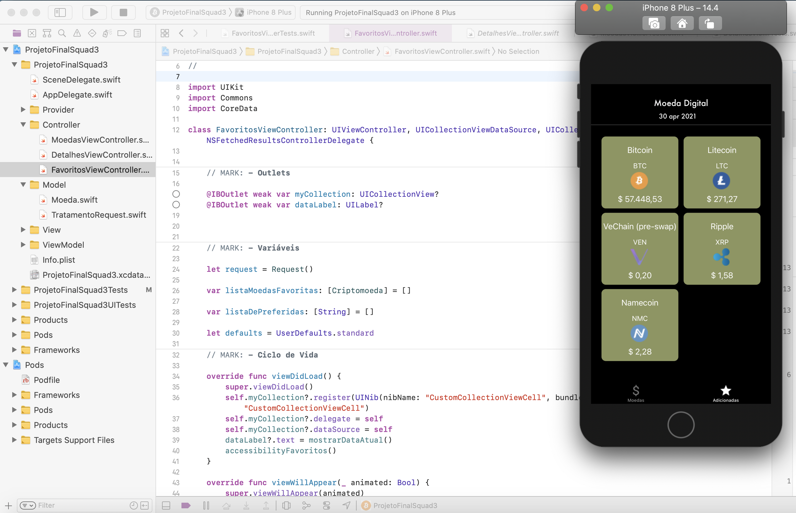
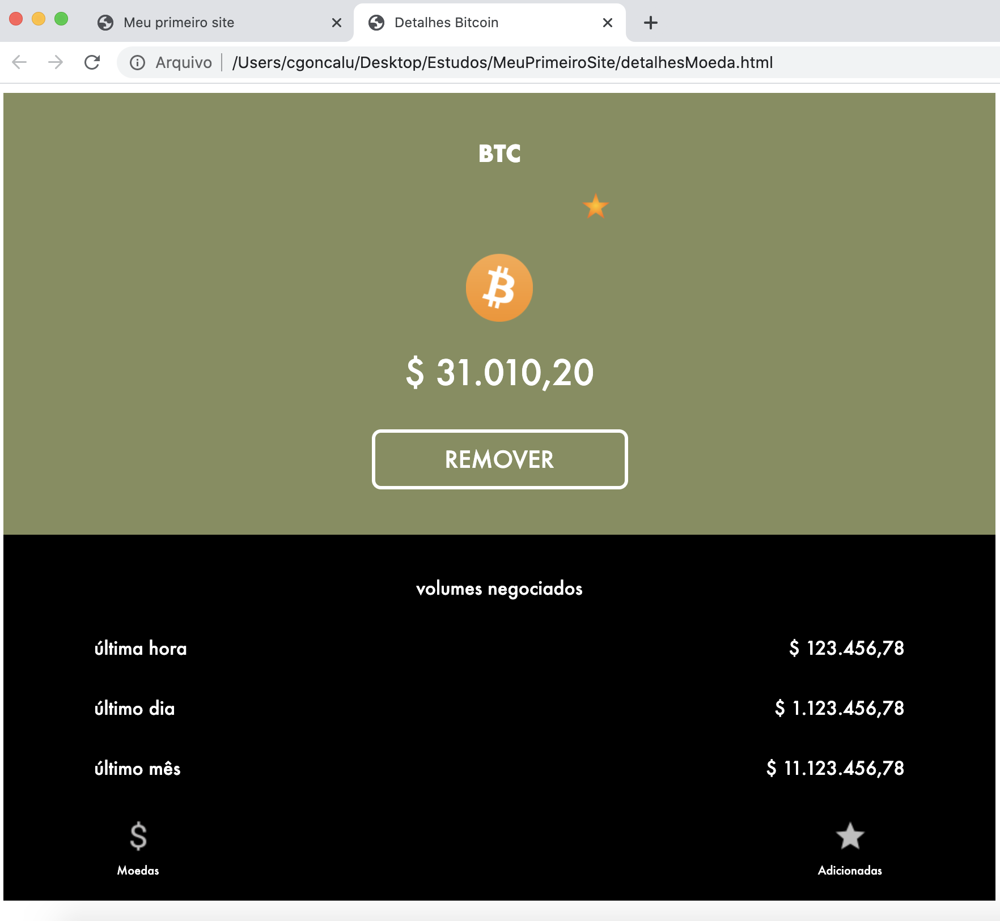
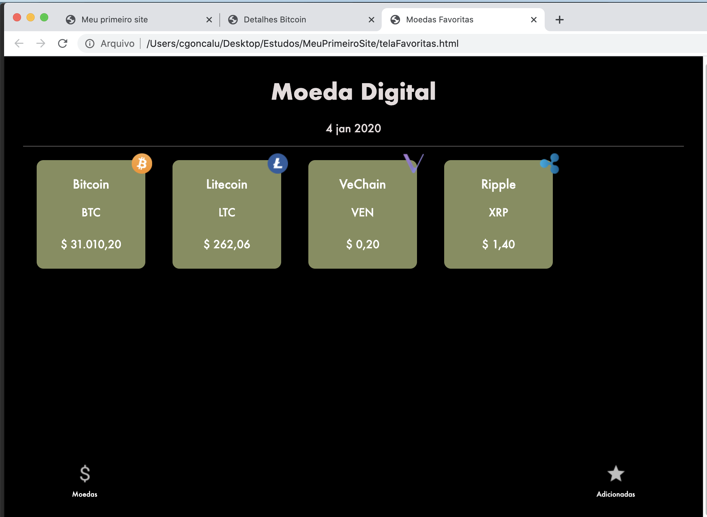
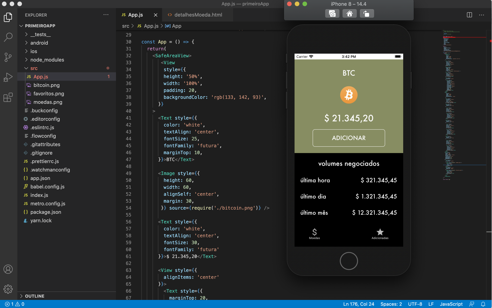
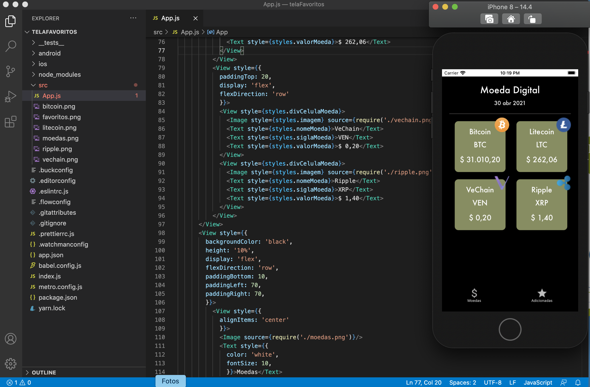

# CriptomoedasPlayground
Recriando os elementos de layout de duas telas do repositório Squad3ProjetoFinal em HTML e ReactNative

Busquei neste desafio recriar as telas Detalhes e Favoritas do aplicativo de Criptomoedas (repositório Squad3ProjetoFinal, branch melhorias) em HTML e ReactNative.

As telas do aplicativo original foram criadas em Swift e estão funcionais:

Telas replicadas em HTML, apenas com elementos visuais estáticos:

Telas replicadas em ReactNative, apenas com elementos visuais estáticos:

